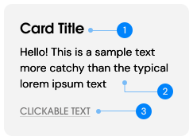

Our design implement cards as a mean to display popping informations and divide sections, either individually or as a group. Cards are also used for pop-up and carousel components.

## Mini Information Card

### Usage
We use mini information cards to display information meant to be important. It is also used to group and organize simple informations for better display to user.

### Structure
An information card may consist of multiple components. The following are the general structure for a typical mini information card.

| Prop name   | Type   | Mandatory/Optional | Description                |
|-------------|--------|--------------------|----------------------------|
| title       | String | Mandatory          | Title of the card          |
| content     | String | Mandatory          | content of the card        |
| linkContent | String | Optional           | Displayed text of the link |
| href        | String | Optional           | Link url                   |
